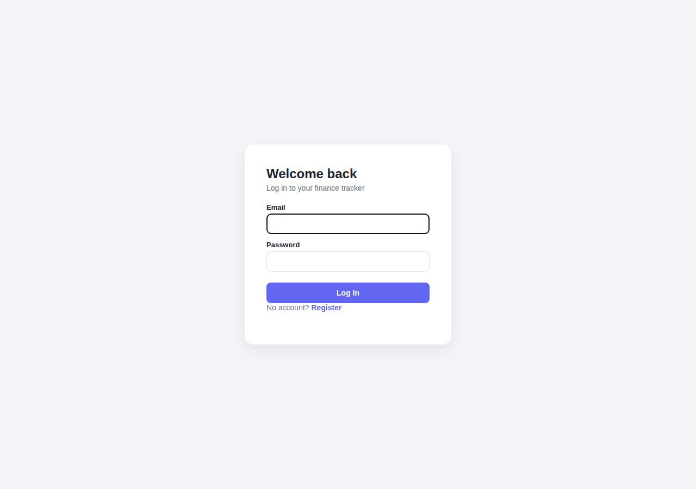
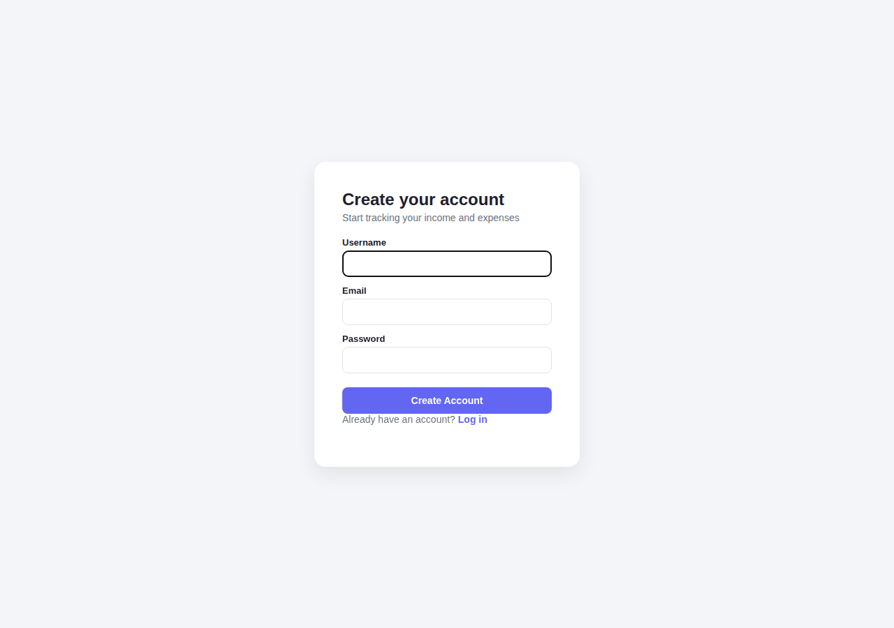
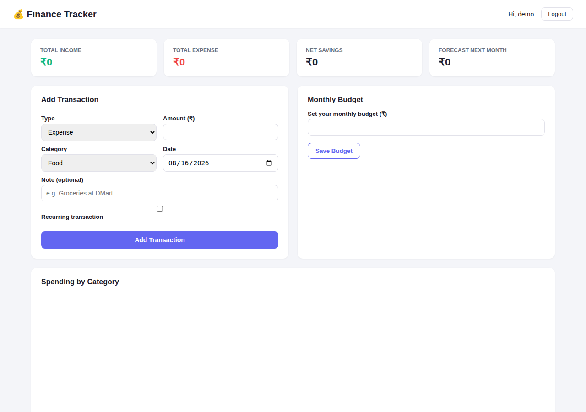
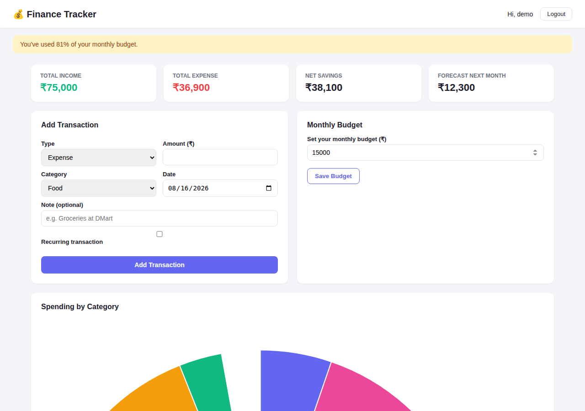
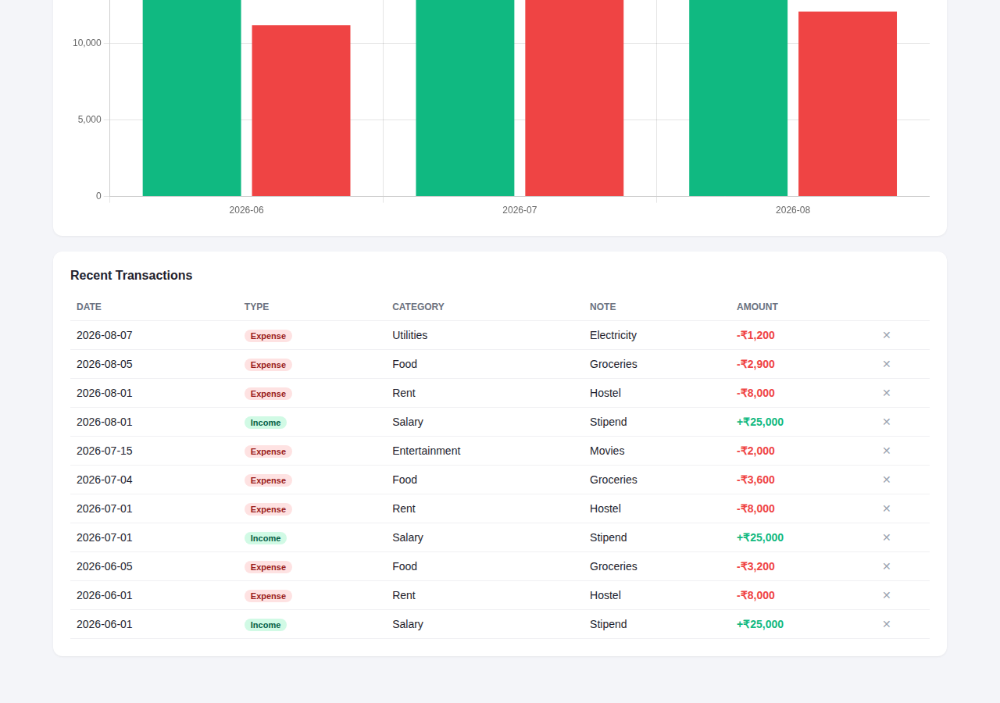

# Personal Finance Tracker with Expense Analytics

A full-stack personal finance tracker built with **Flask**, **SQLAlchemy (SQLite)**, and **Chart.js**.
Users can register/login, log income and expenses, set a monthly budget, and view
interactive analytics — category breakdowns, income vs. expense trends, and a simple
spending forecast for next month.

## Screenshots

*Captured from the actual running app (registered a real user, added real transactions through the UI, verified zero console errors).*

**Login**


**Register**


**Dashboard — fresh account**


**Dashboard — with data, budget alert firing at 81% usage**


**Transaction history**


## Features

-  **Authentication** — secure registration/login with hashed passwords (Flask-Login + Werkzeug)
-  **Transaction management** — add/delete income & expense entries with category, note, and recurring flag
-  **Analytics dashboard** — category-wise doughnut chart and monthly income/expense bar chart (Chart.js)
-  **Spending forecast** — 3-month moving average model predicts next month's likely expense
-  **Budget alerts** — set a monthly budget and get warned at 80%+ and 100%+ usage
-  **Responsive UI** — clean dashboard that works on desktop and mobile

## Tech Stack

| Layer      | Technology                        |
|------------|------------------------------------|
| Backend    | Python, Flask, Flask-SQLAlchemy, Flask-Login |
| Database   | SQLite (swap `SQLALCHEMY_DATABASE_URI` for MySQL/Postgres in production) |
| Frontend   | HTML, CSS, vanilla JavaScript, Chart.js (bundled locally — no CDN dependency) |
| Auth       | Session-based auth, Werkzeug password hashing |

## Project Structure

```
finance-tracker/
├── app.py                 # Flask app: models, routes, analytics logic
├── requirements.txt
├── templates/
│   ├── base.html
│   ├── login.html
│   ├── register.html
│   └── index.html         # main dashboard
├── static/
│   ├── style.css
│   └── app.js              # fetch API calls + Chart.js rendering
└── README.md
```

## Getting Started

### 1. Clone and set up a virtual environment

```bash
git clone https://github.com/abinas-swain/finance-tracker.git
cd finance-tracker
python3 -m venv venv
source venv/bin/activate   # Windows: venv\Scripts\activate
```

### 2. Install dependencies

```bash
pip install -r requirements.txt
```

### 3. Run the app

```bash
python app.py
```

The app creates `finance.db` automatically on first run and starts at
`http://127.0.0.1:5000`.

### 4. Try it out

1. Register a new account.
2. Add a few income and expense transactions.
3. Set a monthly budget to see the alert banner in action.
4. Watch the charts and forecast update in real time.

## API Endpoints

| Method | Endpoint                     | Description                          |
|--------|-------------------------------|---------------------------------------|
| POST   | `/register`                   | Create a new account                  |
| POST   | `/login`                      | Log in                                |
| GET    | `/api/transactions`           | List current user's transactions      |
| POST   | `/api/transactions`           | Add a transaction                     |
| DELETE | `/api/transactions/<id>`      | Delete a transaction                  |
| POST   | `/api/budget`                 | Set monthly budget                    |
| GET    | `/api/analytics/summary`      | Category totals, trends, forecast     |

## How the Forecast Works

The forecast uses a **3-month simple moving average** on expense totals:

```
forecast = average(expense totals of last up to 3 months)
```

This is intentionally lightweight (no external ML dependency) but can be swapped
for a more sophisticated model (e.g. linear regression on `scikit-learn`) — the
`/api/analytics/summary` route is the only place that would need to change.

## Possible Extensions

- Recurring transaction auto-generation (cron/scheduled job)
- Export transactions to CSV/PDF
- Multi-currency support
- Shared/family budgets with multiple users per account
- Switch SQLite → PostgreSQL/MySQL for production deployment

## License

MIT
